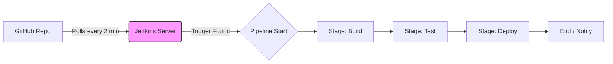

# Jenkins CI/CD Pipeline Automation

**Date:** February 13, 2026
**Topic:** Continuous Integration & Deployment (CI/CD)
**Project:** Node.js + Jenkins (Docker) + Groovy

## Project Overview
This project demonstrates a **Continuous Integration and Continuous Deployment (CI/CD)** pipeline using **Jenkins**, the industry-standard open-source automation server.

Unlike the previous project which used GitHub Actions (a cloud-hosted service), this project implements a **self-hosted** automation environment. The pipeline is defined via code using a `Jenkinsfile` and is designed to automatically build, test, and simulate a deployment whenever changes are detected in the source code.

## 1. What? (The Concept)

**What I Built**
I built a **Declarative Jenkins Pipeline**.
This is an automated workflow managed by a Jenkins server running in a local Docker container. The pipeline is defined in a text file (`Jenkinsfile`) which is committed alongside the application code.

**What It Does**
1.  **Polls:** Checks the GitHub repository for changes every 2 minutes.
2.  **Builds:** Prepares the application environment.
3.  **Tests:** Runs validation scripts to ensure code quality.
4.  **Deploys:** Simulates the release of the application to a production environment.

## 2. Why? (The Purpose)

**Why Jenkins?**
While tools like GitHub Actions are convenient, Jenkins remains the most widely used tool in enterprise environments for specific reasons:
* **Data Sovereignty:** The code never leaves the internal network (if hosted on-premise).
* **Customization:** It has thousands of plugins to integrate with legacy systems.
* **Cost:** It is open-source and free (no per-minute billing like SaaS tools).

**The Problem It Solves**
Without this pipeline, deploying updates requires a developer to manually SSH into servers, pull code, and restart services. This is slow and risky. This project automates that entire lifecycle, ensuring that if the code works on my machine, it will work on the server.

## Tech Stack
| Component | Technology | Description |
| :--- | :--- | :--- |
| **Automation Server** | Jenkins (LTS) | Orchestrating the workflow |
| **Containerization** | Docker | Hosting the Jenkins server |
| **Language** | Groovy | Syntax for the `Jenkinsfile` |
| **Source Code** | Node.js | Application logic |
| **Trigger Mechanism** | Poll SCM | Periodic code checking |

## Project File Structure
```text
jenkins-demo-app/
│
├── .git/                    # Local git configuration
├── node_modules/            # Dependencies (Ignored by Git)
├── .gitignore               # Ensures node_modules are not uploaded
├── index.js                 # The main Node.js application file
├── Jenkinsfile              # The pipeline definition (Crucial File)
├── package.json             # App metadata and scripts
├── package-lock.json        # Exact version lock for dependencies
└── README.md                # Project documentation
```

## 3. How? (The Implementation)
The Workflow Architecture


## Workflow Steps
<details>
<summary>Click to view detailed pipeline stages</summary>

The pipeline is defined in the Jenkinsfile using Declarative Syntax:

Agent Any: Instructions to run this pipeline on any available executor (runner).

Stage 1: Build: Simulates the installation of dependencies (npm install).

Stage 2: Test: Runs unit tests to ensure the application logic is sound.

Stage 3: Deploy: Simulates the final push of the artifact to a server or Docker Registry.

</details>

## How to Run Locally
Since Jenkins is self-hosted, you must run the server yourself.

#### 1. Start Jenkins in Docker:
```
bash

docker run -p 8080:8080 -p 50000:50000 --restart=on-failure --name jenkins-server jenkins/jenkins:lts-jdk17
```

#### 2. Unlock Jenkins:

    - Access http://localhost:8080.

    - Copy the password from the terminal logs.

    - Install recommended plugins.

#### 3. Configure the Pipeline:

    - Create a "Pipeline" job.

    - Select "Pipeline script from SCM" -> "Git".

    - Enter Repository URL: https://github.com/YOUR_USERNAME/jenkins-demo-app.git.

    - Script Path: 'Jenkinsfile.'

## 4. Alternatives (Comparison)
|Tool|Type|Pros|Cons|
|-----|------|------|-----|
|GitLab CI|Integrated|"Excellent visualization, built-in."|Tightly coupled with GitLab.|
|Bamboo|Enterprise|Great Jira/Bitbucket integration|Expensive license costs.|

## 5. Future Improvements
To transition this project from "Demo" to "Production Grade":

1. Webhooks: Replace "Poll SCM" with GitHub Webhooks. This requires exposing the local Jenkins server to the internet (using tools like Ngrok) so GitHub can "push" events instantly.

2. Real Docker Agents: Configure Jenkins to spin up a fresh Docker container for every build (using the Docker Cloud plugin) to ensure a clean environment.

3. Notifications: Add a post { always { ... } } block in the Jenkinsfile to send Slack or Email notifications upon build success or failure.

4. Artifact Archiving: Add a step to actually save the build output (e.g., the .zip or Docker image) using the "Archive Artifacts" plugin.

## Quick Commands Reference
- Start Jenkins: docker start jenkins-server

- Stop Jenkins: docker stop jenkins-server

- Check Logs: docker logs -f jenkins-server

- Git Push: git push origin main

## FAQ / Interview Prep
1. What is Jenkins?
Jenkins is an open-source automation server. It facilitates CI/CD by automating the building, testing, and deploying of code. It is Java-based and runs on almost any OS.

2. What is a Jenkinsfile?
It is a text file that treats the deployment pipeline as code ("Pipeline as Code"). It is stored in the repository, allowing version control and audit trails for the deployment process itself.

3. Declarative vs Scripted Pipelines?

Declarative: (Used here) A stricter, predefined structure. It is easier to read and write. It focuses on what should happen.

Scripted: A general-purpose Groovy script. It is more powerful but harder to maintain. It focuses on how logic is executed.

4. Why use Poll SCM instead of Webhooks?
In this local demo, my Jenkins server is behind a firewall (localhost) and cannot receive traffic from GitHub. Polling allows Jenkins to "reach out" and check for changes periodically. In production, Webhooks are preferred for real-time performance.
